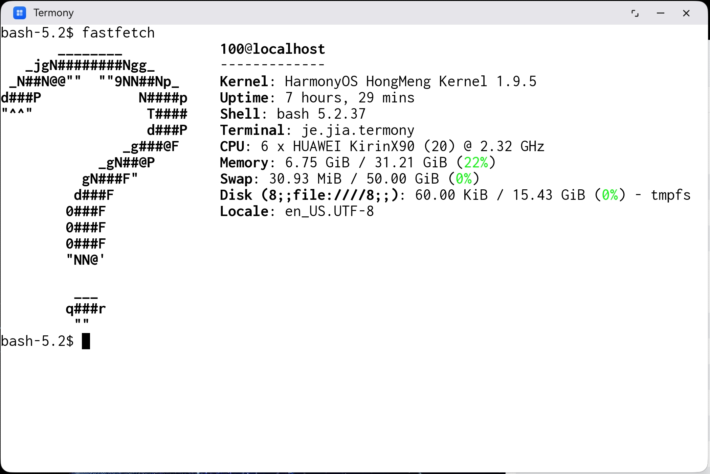

# Termony

Termux for HarmonyOS Computer. Working in Progress.



It can run some basic commands on Huawei MateBook Pro now:


Bundled packages:

- bash
- binutils
- busybox
- c-ares
- coremark
- curl
- fastfetch
- htop
- kbd
- libevent
- libidn2
- libunistring
- lz4
- make
- ncnn
- ncurses
- openssh
- openssl
- readline
- sl
- strace
- stream
- tar
- tmux
- tree
- vim
- vkpeak
- xxhash
- yyjson

## Usage (if you are a Mac user):

1. Connect your MateBook Pro to Mac, and do the following steps on Mac
2. Clone this repo recursively, and cd into this repo
3. Setup code signing in DevEco-Studio, ignore warnings if any
4. Install `wget`, `coreutils` and `ncurses` from homebrew
5. Run `./create-hnp.sh` to create hnp packages
6. Run `./build-macos.sh`
7. Run `./push.sh ./entry/build/default/outputs/default/entry-default-signed.hap`
8. Input command in the text input of the application, press enter

## Usage (if you are a Linux user):

1. Connect your MateBook Pro to a Linux machine, and do the following steps
2. Clone this repo recursively, and cd into this repo
3. Setup code signing in DevEco-Studio, ignore warnings if any
4. Setup DevEco Command Line Tools, and make sure `$TOOL_HOME` env var is a correct directory to SDK
5. Run `./build-linux.sh -b` to create hnp packages
6. Run `./build-linux.sh -s` to signing
7. Run `./build-linux.sh -p`
8. Input command in the text input of the application, press enter

## How does it work

By examining CodeArts IDE, we found that it utilizes HNP packages for native programs. You need to package `.hnp` files into the `.hap`, and add them to `module.json5` like:

```json5
{
  "module": {
    "hnpPackages": [
      {
        "package": "busybox.hnp",
        "type": "private"
      }
    ]
  }
}
```

Then, you need to add the `.hnp` files to `.hap` and sign the `.hap` manually. You can refer to `sign.py` to see how it is done. The `.hnp` packages are unpacked under `/data/app` automatically and symlinks are created under `/data/app/bin`.
