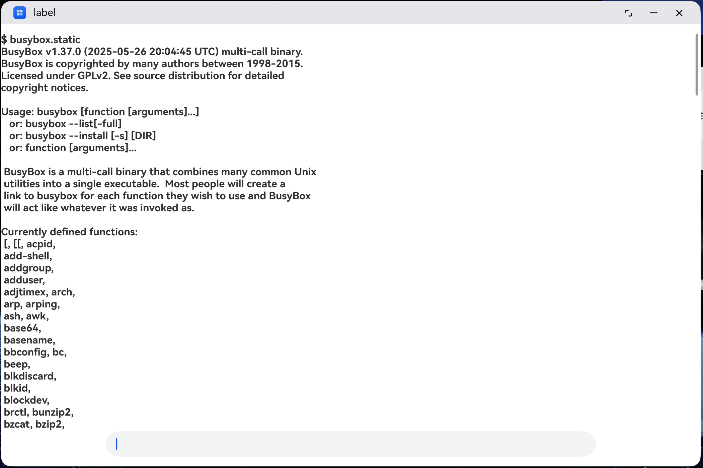
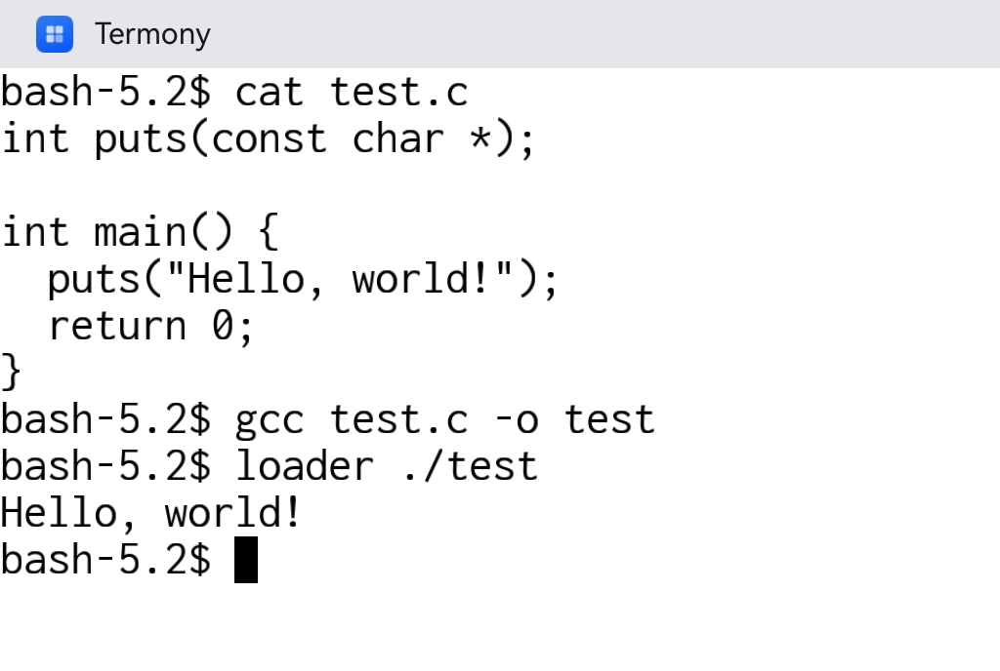
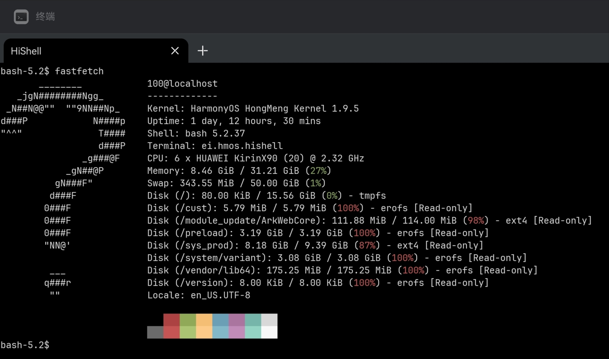

# Termony

[GitHub](https://github.com/jiegec/Termony) [Gitee](https://gitee.com/jiegec/Termony)

Termux for HarmonyOS Computer. Working in Progress.

It can run some basic commands on Huawei MateBook Pro now:



Also compile and run C/C++ programs on HarmonyOS Computer:



## Overview

Bundled packages:

- aria2
- bash
- binutils
- busybox
- c-ares
- coremark
- curl
- [elf-loader](https://github.com/MikhailProg/elf) (you can run executable without executable permission! e.g. `cp /data/app/bin/bash ~/ && loader ~/bash`)
- expat
- fastfetch
- fish
- gcc
- gdb
- git
- gmp
- hdc
- htop
- kbd
- libarchive
- libevent
- libglib
- libidn2
- libunistring
- lz4
- make
- mpc
- mpfr
- ncnn
- ncurses
- openssh
- openssl
- pcre2
- proot
- python
- qemu (you can run executable without executable permission! e.g. `cp /data/app/bin/bash ~/ && qemu-aarch64 ~/bash`)
- readline
- sl
- strace
- stream
- talloc
- tar
- tmux
- tree
- vim
- vkpeak
- xxhash
- xz
- yyjson
- zstd

Pro tip: you can use these utilities in the builtin Terminal app under `/data/service/hnp`:



Although some paths might get wrong due to prefix set to `/data/app/base.org/base_1.0` (thanks to @duskmoon314). You can override them like:

```shell
LD_LIBRARY_PATH=/data/service/hnp/base.org/base_1.0/lib TERMINFO=/data/service/hnp/base.org/base_1.0/share/terminfo fish
```

You can persist them to `~/.bashrc`, and run bash before executing other commands from Termony:

```shell
if [ -d "/data/service/hnp/base.org/base_1.0" ]; then
  export LD_LIBRARY_PATH=/data/service/hnp/base.org/base_1.0/lib
  export TERMINFO=/data/service/hnp/base.org/base_1.0/share/terminfo
  export VIM=/data/service/hnp/base.org/base_1.0/share/vim
  export TMUX_TMPDIR=/data/storage/el2/base/cache
fi
```

However, the builtin Terminal app does not have the permission to map R+X pages, so you cannot use elf loader there. You can use it in Termony. Also, the public folder does not get updated if you upgrade Termony. You need to re-install Termony to get the latest version available.

Terminal features:

- Basic escape sequence support
- Paste via context menu (right-click to activate)
- Copy/paste in command line via pbcopy/pbpaste using OSC52 escape sequence

## Usage (if you are a Mac user):

1. Connect your MateBook Pro to Mac, and do the following steps on Mac
2. Clone this repo recursively, and cd into this repo
3. Setup code signing in DevEco-Studio, ignore warnings if any
4. Install `wget`, `coreutils`, `make`, `gsed`, `gettext`, `automake`, `cmake`, `pkg-config` and `ncurses` from Homebrew or Nix
5. (M-series User) `export PATH="/opt/homebrew/opt/coreutils/libexec/gnubin:/opt/homebrew/opt/gnu-sed/libexec/gnubin:/opt/homebrew/opt/make/libexec/gnubin:$PATH"`
6. Run `./create-hnp.sh` to create hnp packages
7. Run `./build-macos.sh`
8. Run `./push.sh ./entry/build/default/outputs/default/entry-default-signed.hap`
9. Try Termony on you HarmonyOS Computer

## Usage (if you are a Linux user):

1. Connect your MateBook Pro to a Linux machine, and do the following steps
2. Clone this repo recursively, and cd into this repo
3. Setup code signing in DevEco-Studio, ignore warnings if any
4. Setup DevEco Command Line Tools, and make sure `$TOOL_HOME` env var is a correct directory to SDK
5. Run `./build-linux.sh -b` to create hnp packages
6. Run `./build-linux.sh -s` to sign the hap file
7. Run `./build-linux.sh -p` to push and install Termony on your device
8. Try Termony on you HarmonyOS Computer

## Usage (if you are a Windows user):

1. Connect your MateBook Pro to a Windows machine, and do the following steps
2. Install WSL (Ubuntu recomended), and build hap with following steps, like Linux
3. Clone this repo recursively, and cd into this repo
4. Setup code signing in DevEco-Studio, ignore warnings if any
5. Setup DevEco Command Line Tools in WSL, and make sure `$TOOL_HOME` env var is a correct directory to SDK
6. In WSL, run `./build-linux.sh -b` to create hnp packages
7. In WSL, run `./build-linux.sh -s` to sign the hap file
8. In Windows terminal, use `hdc` on Windows to send and install hap file, like `hdc_push` in `build-linux.sh`
9. Try Termony on you HarmonyOS Computer

## How does it work

By examining CodeArts IDE, we found that it utilizes HNP packages for native programs. You need to package `.hnp` files into the `.hap`, and add them to `module.json5` like:

```json5
{
  "module": {
    "hnpPackages": [
      {
        "package": "busybox.hnp",
        "type": "private"
      }
    ]
  }
}
```

Then, you need to add the `.hnp` files to `.hap` and sign the `.hap` manually. You can refer to `sign.py` to see how it is done. The `.hnp` packages are unpacked under `/data/app` automatically and symlinks are created under `/data/app/bin`.
